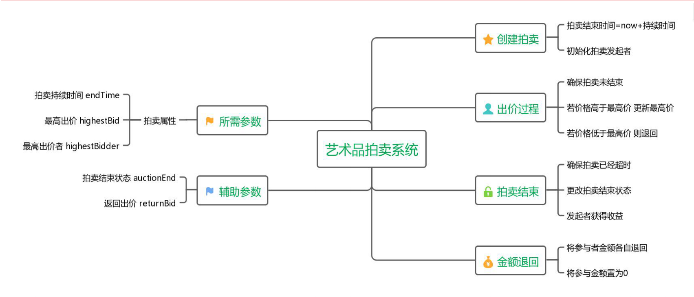
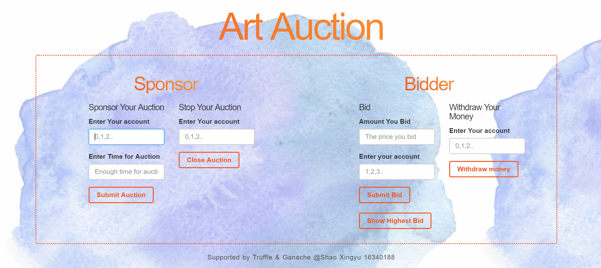

# Art Auction DAPP

区块链期末项目：艺术品拍卖系统 16340188邵星语

在网页端运行，实现对艺术品拍卖、竞价及完成转账的拍卖系统。该dapp基于Truffle框架，使用web3与javascript交互。智能合约使用solidity编写，部署在ganache的私链上。

## Contents
- [Developing Environment](#developing-environment)
- [Run](#run)
- [Subject Background](#subject-background)
- [Function](#function)
	- [Structure](#structure)
	- [Main Function](#main-function)
- [Test Result](#test-result)
- [Project Process](#project-process)
	- [Contract and Migration](#contract-and-migration)
	- [Interaction](#interaction)
	- [User Interface](#user-interface)
- [Problems and Solution](#problems-and-solution)
- [Feelings](#feelings)

## Developing Environment

**Contract and Migration Part**

- Truffle v4.1.14
- Ganache v1.2.2
- solidity

**Interaction Part**

- Javascript
- JQuery
- Web3.js

**User Interface**

- Html、css

- Bootstrap
- Animate.css
- Google Fonts

## Run

1.Install Truffle globally.

```
npm install -g truffle
```

2.Compile the subject.

```
truffle compile
```

3.Install Ganache or Ganache-cli(TestRPC), build private chain.

4.Migrate the contract.

```
truffle migrate
```

5.Run the webpack server for front-end hot reloading.  Serves the front-end on http://localhost:8080.

```
npm run dev
```

6.Open  http://localhost:8080 to see the web page.


## Subject Background

​	在科学技术不断发展，各种新技术层出不穷的今天，优秀的艺术品仍旧是人类文化中不可多得的宝贵财富，追随艺术的脚步从未停止。艺术品正因其独特性才能够拥有价值，而拍卖会上屡次发生的赝品拍卖事件着实让人苦恼。对于竞拍者而言，高价收到赝品无疑是最令人失望的事。而更令人意外的是，真品被不知情者低价转手现象也时有发生。

当下的艺术品拍卖活动，存在以下几个缺点：

- 赝品拍卖层出不穷，真假难辨。

- 拍卖中介公司的信用问题。
- 具有地域局限性。

​       应用区块链技术，这些情况就可以得到有效改善。

​       由于区块链的难以篡改性，可以将每份真品的交易过程都写入该艺术品的链条，在拍卖时，将拍卖成功的信息更新入链条，便可以完成一次交易。当需要对艺术品的真假进行判断时，可以通过查阅交易记录判断真假。

​       另一方面，区块链的非中心化使拍卖过程无需引入第三方机构，也无需昂贵的中介费。而区块链的每一条记录都真实可靠，有迹可循，这就抛开了拍卖公司的信用问题。

​       除此之外，通过智能合约进行拍卖时，属于线上操作，竞价者无需到场，交易记录即是合同本身。区块链的引入可以改变艺术拍卖界的地域局限性，规范各类不同的拍卖会和拍卖机构，让世界范围内的艺术爱好者都可以简单的参与到艺术品拍卖中来。

## Function

### Structure



### Main Function

拍卖发起者Sponsor:

- 发起拍卖
  - 输入账号地址发起拍卖
  - 设置拍卖时间，单位为秒（在该时间之内不能私自停止拍卖）
- 结束拍卖
  - 输入账号地址结束拍卖（确保时间已到）此时竞价最高者金额到达该账户

竞价者Bidder:

- 竞价：
  - 输入账号地址进行竞价
  - 输入竞价金额 竞价成功后金额不到达发起者账户
- 退回金额：
  - 输入账号，将未成功竞价金额退回（确保拍卖发起者结束拍卖）若出价最高则无法退回
- 查看最高价：
  - 点击按钮可查看目前最高出价


## Test Result



**Demo Movie**

 [Demo Movie Here](https://v.youku.com/v_show/id_XMzk4NTcwMzAwNA==.html?spm=a2hzp.8244740.0.0)

- It is recommended to watch at 1.5 times the speed

**Demo Process**

界面左边为拍卖发起者部分，右边为竞价者部分。示例视频过程如下：

- 打开网页，显示网页下落动画和变色文字；

- 在拍卖发起表单处，未填写任何内容点击submit按钮，输入框提示“请填写该字段”；
- 打开Ganache，复制accounts[0]的地址填入发起者账户，设置拍卖时间80秒；
- 点击SubmitAuction按钮，上方alert提示拍卖发起成功。
- 设置竞价金额为20以太币，复制accounts[1]的内容到竞价者账户处，点击SubmitBid按钮,alert提示竞价成功。打开ganache查看accounts[1]账户，减少20以太币；
- 设置竞价金额为30以太币，复制accounts[2]的内容到竞价者账户处，点击SubmitBid按钮,alert提示竞价成功。打开ganache查看accounts[2]账户，减少30以太币；
- 此时查看最高竞价，为30以太币；
- 设置竞价金额为40以太币，复制accounts[3]的内容到竞价者账户处，点击SubmitBid按钮,alert提示竞价成功。打开ganache查看accounts[1]账户，减少40以太币；
- 此时查看最高竞价，为40以太币；
- 设置时间80s已过，输入拍卖者账号，点击关闭拍卖；此时查看ganache，拍卖者账户获得最高竞价40以太币。（少的金额为一开始部署合约使用的）
- 分别使用accounts1和2、3的账号点击withdraw money，查看ganache，1账户和2账户退回了出价20和30以太币，而3账户为出价最高者，并未退回。

## Project Process

### Contract and Migration

第十二周时完成了项目的智能合约编写、部署和测试。在部署时就使用了Truffle和Ganache，以便之后前端交互部分的完成。

##### 智能合约编写

该合约使用solidity编写，主要分为发起拍卖、进行竞价、结束拍卖和退回金额几个部分。其中涉及交易的竞价为payable函数，整个代码的逻辑如structure部分所示。带有注释的代码位于./contracts/ArtAuction.sol中。

##### 智能合约部署

1 首先创建项目，由于该项目需要使用web进行交互，我们使用truffle box中的webpack box来进行创建：

```
truffle unbox webpack
```

实际操作时，使用该命令速度较慢且总是出错，我直接找到了webpack的github仓库clone了下来。

2 查看项目结构：


- app/：放置交互所需的脚本内容，包括html、css文件和js等。
- build/：包括已经编译和部署过的历史信息（这里是我编译运行过的结构）。
- contracts/：放置合约的文件夹。
- migrations/：处理部署（迁移）合约的文件。
- node_modules：node.js的库；
- test：truffle test所需文件。

3 在contract文件夹下放置编写好的智能合约ArtAuction.sol，使用truffle compile命令进行编译。

4 编译通过后对智能合约进行部署。在migrations文件夹下，可以看到已经有一个1_initial_migration.js部署脚本，是用来部署migration.sol合约的；新创建一个2_deploy_contracts.js，来对新合约进行部署。

```javascript

var ArtAuction = artifacts.require('./ArtAuction.sol');

module.exports = function(deployer) {
    deployer.deploy(ArtAuction);
}

```

5 部署脚本完成后，需要将合约部署到区块链上。公链的成本较高，因此测试时会部署到自己的私链上；而truffle旗下的ganache可以帮助我们创建私链，方便智能合约的部署。安装完成后，运行ganache，可以看到它默认已经为我们创建好了10个账户，每个账户有100个以太币，并自动挖矿。

6 ganache上方可以看到端口号和地址。将对应的默认端口号填入truffle.js里，连接ganache环境：

```javascript
module.exports = {
  networks: {
    development: {
      host: "localhost",
      port: 7545,
      network_id: '*' // Match any network id
    }
  }
}
```

7 输入truffle migrate命令对合约进行部署。部署完成后，在ganache的窗口中可以看到区块的增多和账户金额的改变。

8 对部署好的智能合约进行测试。这部分包括在12周时的部署报告中，这里不再赘述。

### Interaction

##### html编写

布局包括拍卖者部分和竞价者部分。按照一般的网站形式而言，应该将两者放在不同的界面上，通过首页进入。但一方面我的智能合约实现的功能并不多，拆开来看非常空；另一方面分开来进行操作不利于之后交替进行测试，因此还是放在了一个界面上。所以这个项目还非常不成熟，仅仅是对基础功能的实现而已。

##### Bootstrap

bootstrap是html css和js部分的开发框架，其中文文档位于：http://www.bootcss.com/。使用bootstrap进行前端开发时会更容易上手操作。将bootstrap的库添加在html的头文件里即可使用：

```html
<link rel="stylesheet" href="https://cdn.bootcss.com/bootstrap/4.0.0/css/bootstrap.min.css" integrity="sha384-Gn5384xqQ1aoWXA+058RXPxPg6fy4IWvTNh0E263XmFcJlSAwiGgFAW/dAiS6JXm" crossorigin="anonymous">
```

本次主要使用到了其中的栅格布局和表单元素。栅格布局是bootstrap的一种布局形式，通过将整个界面分为很多的行和列进行布局，很容易上手。通过输入不同的class，就能使用其css库进行渲染，更改元素的长度和位置进行放置，具体请参考中文文档。

如最左边一列的栅格布局如下：

```html
<div class = "row">
		<div class="container">
	    	<form id="auction" class="col-sm-2 col-md-offset-1">
	    	...
	    	</form>
	    </div>
</div>
```

`class = "row"`是行类型，先创建行再将行分为不同的列。每个列应该包含在container里，而最重要的则是之后的`<form id="auction" class="col-sm-2 col-md-offset-1">`，col-sm-2意为该列占据两列空间，col-md-offset-1则意为这该列向右偏移一列。

表单元素则为填写表单时的一系列输入框和提交按钮的集合，标签为form。使用该元素会使这些更容易控制。将元素设置为`class="form-group"`即为表单类型，每个输入框要设置label属性代表其内容，设置class为form-control意为这是表单内部的元素。最后使用button对其进行操作。最左一列的表单如下：

```html
<form id="auction" class="col-sm-2 col-md-offset-1">
	    	<h4>Sponsor Your Auction</h4>
	    	<div class="form-group">
	       		<label for="sponsor-account1">Enter Your account</label>
	       		<input type="text" class="form-control" name="sponsor-account1" id="sponsor-account1" placeholder="0,1,2.." required="required">
	        </div>
	        <div class="form-group">
	        	<label for="auction-time">Enter Time for Auction</label>
	        	<input type="text" class="form-control" name="auction-time" id="auction-time" placeholder="Enough time for auction" required="required">
	        </div>
	       	<button type="submit" class="btn">Submit Auction</button>
	   		</form>
```

##### javascript编写

本次完成的主要部分就是对js的编写，主要使用jquery和web3来对合约内容进行交互。

导入web3、contract内容，以及json文件，其中包括了ABI信息及部署后的网络(地址)信息，传入实例化合约。

```javascript
import {
  default as Web3
} from 'web3';
import {
  default as contract
} from 'truffle-contract'
import art_auction_artifacts from '../../build/contracts/ArtAuction.json'
import '../styles/app.css'

var ArtAuction = contract(art_auction_artifacts);
const ethUtil = require('ethereumjs-util');
```

在一开始部署合约，返回一个实例：

这里由于我不设置默认地址时，传入地址会报地址不合法的错误，因此使用defaults设置了默认地址。

```javascript
	var deployed;
    ArtAuction.setProvider(web3.currentProvider);//set provider
    ArtAuction.defaults({from:web3.eth.accounts[0]});
    ArtAuction.deployed().then(function(i){
        deployed = i;
    console.log("deployed successfully!");
    });

```

对提交按钮的监听事件：以提交一个拍卖为例，首先将提示框隐藏，在提交事件中调用合约中的artAuction函数，传入对应参数之后输出提示消息。其他按钮的监听事件也类似。`event.preventDefault()`是为了防止点击submit时自动刷新表单。

```javascript
$("#auction").submit(function(event) {
    	$("#msg").hide();
        const sponsorAccount1 = document.getElementById('sponsor-account1').value;    
    	let auctionTime = $("#auction-time").val();
    	console.log(sponsorAccount1 + " sponsored " + auctionTime);
    	deployed.artAuction(auctionTime, sponsorAccount1).then(
	    	function(f){
	    		$("#msg").html("Your auction has been successfully submitted!");
	           		$("#msg").show();
	            		console.log(f)
	    			}
    			);
    		event.preventDefault();//防止刷新
        });

```

在代码最后添加上windows.addEventListener()函数，设置默认和对应端口的provider。这里注意与私链端口相对应。

### User Interface

##### Animate.css

animate.css是一个前端动画库，github仓库：https://github.com/daneden/animate.css

这次使用这个动画库实现了主页打开时元素的下落，使用方法也很简单，同样首先在html头部引入animate.css库：

```html
  <link rel="stylesheet" href="animate.min.css">
```

再给需要动画的元素加上需要实现动画的class即可。

```html
<h1 class="animated infinite bounce delay-2s">Example</h1>
```

##### 动态字体变色

参考了animate.css首页字体和按钮变色的实现方法，将背景颜色置为透明后添加无限循环动画，进行线性颜色改变即可。以边框为例：

```javascript
#border{
    background-color: transparent;
    border-radius: 4px;
    border: 2px solid #f35626;
    border-style: dotted;
    margin-left: 8rem;
    margin-right: 10rem;
    margin-top: 3rem;
    padding-bottom: 3rem;
    padding-top: 2rem;
    animation: hue 10s infinite linear;
}
```

## Problems and Solution

1、执行`npm run dev`时报错`‘webpack-dev-server’不是内部或外部命令，也不是可运行的程序`：

可能是项目下的node_modules文件夹不包括这部分，或者并没有全局安装该部分，在文件夹下执行：

```
npm install
npm run build
```

之后再执行`npm run dev`。

2、 端口不对应：

ganache的默认端口是7545，而ganache-cli为8545。在对webpack配置的端口进行更改时，注意更改truffle.js和网页js里为web3提供provider部分的端口。

3、 无法跨域访问：

```
The value of the 'Access-Control-Allow-Origin' header in the response must not be the wildcard '*' when the request's credentials mode is 'include'. Origin 'http://localhost:7545' is therefore not allowed access. The credentials mode of requests initiated by the XMLHttpRequest is controlled by the withCredentials attribute.
```

这个问题是解决最久的一个。由于端口不同，网络进行访问时会出现跨域访问的错误，而这种问题一般有几种解决方法：

（1）使用geth进行配置时，在后面加上--rpccorsdomain指令。而我使用的是ganache，似乎不能用这个方法；

（2）谷歌商店的小程序里有解决关于跨域问题的网页端程序，，如Allow-Control-Allow-Origin，看评论似乎效果很好。但意外的对于我的问题没有解决作用。

（3）想到降低安全级别也许可以解决这个问题，搜资料后新建chrome的快捷方式，并在后面加上`--disable-web-security --user-data-dir`，最终解决了这个问题。该问题对于本地调试是很有效的，但对于软件成品长远来看显然不是可取的办法，只是临时解决了这一点。

4、输入address后提示地址非法：

在输入框内输入正确格式的地址，然而控制台报错提示地址非法。搜索资料后发现使用default函数添加默认账户可以解决这个问题：

```
ArtAuction.defaults({from:web3.eth.accounts[0]});
```

5、一些不应该出现的问题

除了跨域问题之外，解决最久的一个问题就是点击按钮后界面莫名其妙自己刷新重来，控制台也并不报错。以为是逻辑上的问题因此看了很久很久代码，想了各种方法之后，最终发现错误是一行jquery获取元素时忘记了加#号。之后debug要从最底层开始。

## Feelings

这次项目完成的还有很多很多要改进的地方，实现的只是最基础的功能而已。关于艺术品拍卖的部分，最起码应该加上拍卖物品的名称、简介与图片，但这一部分需要在区块链上添加图片并存储。了解到IPFS可以实现这部分功能，但期末时间过于仓促，就没有完成。

除此之外，网页端如果与钱包进行交互体验会更好，更接近实际操作时的体验，用户可以随时查看自己的账户余额并对交易进行确认，但这和我把拍卖者与竞价者放在一起的初衷相同，都是为了使我在完成项目时更容易对多个账户进行操作，从而进行调试，因此仍旧使用了ganache进行查看。如果该项目设计的比较完全，那么与钱包进行交互是必要的。

当然，这次项目也有很多收获。在区块链方面，对智能合约、truffle框架、web3.js的理解有了一个较大程度的突破，直接上手操作比听理论要来的丰富。在UI设计上，初次尝试了一些外部库，如bootstrap、animate.css等，意识到一些东西比起自己从底层一步步去实现，不如引用一些更为方便的库。对jquery有了一定程度的熟悉，web方面也是熟悉了一遍。

项目结束也将近课程尾声，这次项目是基于以太坊，即被称为区块链2.0的项目。对于接触课程前的我而言，区块链似乎总是跟比特币挂钩，学习过程中才发现数字货币并不是区块链的全部，甚至已经过时了。这次项目的开发，更让我体会到了区块链的实际应用，相信不仅是2.0时代，3.0时代的企业级应用也同样有着强大的应用，区块链仍然焕发生机。
